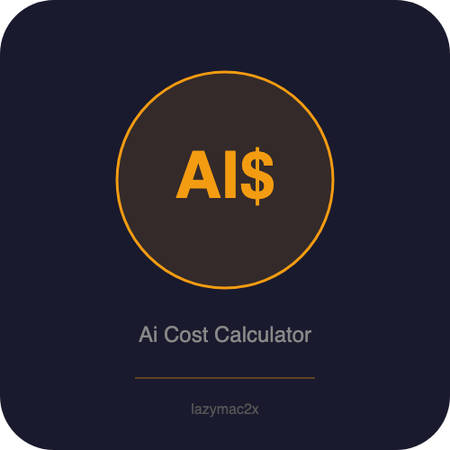

<p align="center"></p>

[](https://lazymac2x.github.io/lazymac-api-store/) [](https://coindany.gumroad.com/) [](https://mcpize.com/mcp/ai-spend-tracker-api)

# ai-spend-tracker-api

[](https://www.npmjs.com/package/@lazymac/mcp)
[](https://smithery.ai/server/lazymac/mcp)
[](https://coindany.gumroad.com/l/zlewvz)
[](https://api.lazy-mac.com)

> 🚀 Want all 42 lazymac tools through ONE MCP install? `npx -y @lazymac/mcp` · [Pro $29/mo](https://coindany.gumroad.com/l/zlewvz) for unlimited calls.

AI Spend Tracker API — track and analyze spending across OpenAI, Anthropic, Google, Mistral, Cohere & more. Aggregate costs, set budgets, get alerts, and visualize usage trends. REST + MCP server.

## Quick Start

```bash
npm install && npm start  # http://localhost:3000
```

## Features

- Multi-provider spend tracking (OpenAI, Anthropic, Google, Mistral, Cohere, etc.)
- Budget management with configurable alerts
- Usage analytics and trend visualization
- Cost breakdown by model, project, and time period
- MCP server for AI assistant integration

## License
MIT

<sub>💡 Host your own stack? <a href="https://m.do.co/c/c8c07a9d3273">Get $200 DigitalOcean credit</a> via lazymac referral link.</sub>
